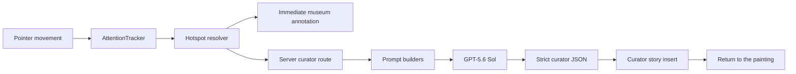

# Look Closer

An immersive artwork viewer that notices where your attention settles, then quietly opens a path into the story behind that detail.

## Inspiration

Museums ask for a particular kind of attention. You stand still, look slowly, and often become interested in a gesture or expression before you know how to describe it.

Most digital art experiences interrupt that moment. They begin with menus, hotspots, search boxes, or a chatbot waiting for a question. Look Closer began with a different possibility: what if the interface could respond to the act of looking itself?

## The Problem

Art guides usually assume that curiosity starts as a well-formed question. In practice, it often starts much earlier—as a pause, a return, or a few seconds spent following one figure in a crowded composition.

Traditional hotspots make every story visible at once and turn the painting into a diagram. Chat interfaces move attention away from the artwork and toward an empty text box. Both approaches ask the visitor to operate software when they should be looking.

## Our Idea

Look Closer treats attention as the first interaction.

There are no permanent markers on the painting. As the visitor moves naturally across the work, a small attention engine considers dwell time, cursor speed, movement range, and repeat visits. When a meaningful pause occurs inside a known region, a restrained museum annotation appears near the point of attention.

The note first acknowledges the visitor—*your attention settled here*—before offering any interpretation. Clicking it opens a curator insert connected to the same region of the painting. The sequence is intentionally simple:

**attention → curiosity → discovery → return to the painting**

## Demo

**Live experience:** [look-closer-masterpiece.vercel.app](https://look-closer-masterpiece.vercel.app/)

Enter the artwork viewer and move slowly across *The Last Supper*. Let the cursor linger over a figure, gesture, or architectural detail for roughly 1.5–2 seconds. Slow movement still counts; there is no need to hold the mouse perfectly still.

When the curator note appears, click it to open the deeper story. Use **Return to the painting**, **Continue looking**, or **Keep exploring** to resume the exhibition.

The current demo contains one artwork and twelve invisible, hand-authored regions.

## Features

- Attention-aware dwell detection that responds to slow exploration, not only a stationary cursor
- Twelve deterministic hotspots aligned to figures, gestures, objects, and compositional details
- No permanent markers or visible hotspot overlays
- Viewport-aware museum annotations with per-region direction and placement
- A bookmark-like curator panel that keeps the selected painting region softly illuminated
- Repeat-visit awareness for details that continue to draw the visitor back
- GPT-generated curator writing grounded in verified local artwork notes
- Strict Structured Outputs for predictable rendering
- Deterministic fallback copy when the OpenAI request is unavailable
- Server-only API credentials and clear `openai` / `fallback` provenance logging

## Tech Stack

- [Next.js 16](https://nextjs.org/) with the App Router
- React 19
- TypeScript
- Tailwind CSS 4
- [OpenAI Responses API](https://developers.openai.com/api/docs/models/gpt-5.6-sol) with GPT-5.6 Sol
- Vercel

## Architecture



### The attention engine

`AttentionTracker` runs entirely in the browser. It converts pointer coordinates into positions relative to the artwork and checks them against invisible hotspot regions defined in `src/data/last-supper.ts`.

Attention accumulates at different rates according to cursor speed. A slow drift counts almost as strongly as stillness; fast movement contributes little or reduces progress. Movement inside a small focus range remains part of the same observation, while leaving the region resets the interaction. A recent return to the same detail receives a slightly shorter threshold.

Overlapping regions are resolved deterministically. A specific figure or object takes precedence over a substantially broader scenic area; similarly sized neighboring regions are selected by relative distance to their centers. This prevents a background hotspot from stealing the story intended for a nearby figure.

This is cursor-based attention inference—not eye tracking, camera tracking, or computer vision.

### The AI curator

Once attention is detected, the interface can respond immediately with deterministic copy while the curator request completes in the background. The selected hotspot remains locked through the annotation and story panel, so asynchronous text cannot switch the story underneath the visitor.

The server receives more than a hotspot name. Its context includes the artwork metadata, hotspot ID and label, story index, dwell duration, visit count, previously visited regions, prior curiosity notes, attention pattern, and current interaction stage. Artwork claims are grounded in factual and story seeds stored with each hotspot.

The prompt architecture is deliberately separated from the API route:

- `src/prompts/curator-system-prompt.ts` defines the curator's identity and voice.
- `src/prompts/curator-user-prompt.ts` builds the visitor-specific attention context.
- `src/prompts/curator-output-schema.ts` owns the strict response contract.
- `src/app/api/curator/route.ts` validates input, resolves the hotspot, calls OpenAI, validates the response, and records its source.

The curator is instructed to recognize attention before introducing facts, assume the visitor is intelligent, reveal one meaningful insight, and leave enough unresolved to invite another look.

### How GPT-5.6 is used

GPT-5.6 Sol is called from the server through the Responses API with low verbosity and `reasoning.effort` set to `none` for a responsive museum interaction. The browser never receives the OpenAI API key.

The model does not detect the artwork region. Hotspot selection remains local and deterministic so the demo behaves reliably. GPT-5.6 receives the resolved context and returns strict JSON containing:

```json
{
  "annotation": "Your attention has settled here.",
  "subtitle": "A quiet gesture changes the rhythm of the room.",
  "title": "The Weight of a Small Gesture",
  "observation": "...",
  "why": "...",
  "next": "...",
  "cta": "Continue looking"
}
```

Every successful response is marked `source: "openai"`. Missing credentials, timeouts, invalid output, and upstream errors use the same UI contract with `source: "fallback"` and a logged reason.

### How Codex was used

Codex was the implementation partner throughout the build, not a one-off code generator. It helped translate the initial visual mockups into reusable Next.js components, refine the attention model across repeated interaction tests, reorganize the curator prompts, and diagnose hotspot, annotation-placement, story-locking, and API provenance issues.

It was also used for the less visible production work: reading the repository's installed Next.js documentation, running lint and production builds, exercising the app in a browser, making real local and deployed curator requests, inspecting server logs, publishing the final Git history, and configuring the Vercel deployment.

## Installation

Requirements:

- Node.js 20.9 or newer
- npm
- An OpenAI API key for dynamic curator writing

```bash
git clone https://github.com/baidiwang/LookCloser.git
cd LookCloser
npm install
cp .env.example .env.local
```

The application still runs without an API key by using deterministic fallback copy.

## Environment Variables

Add the following to `.env.local`:

```bash
# Server-side only. Never expose this as a NEXT_PUBLIC_ variable.
OPENAI_API_KEY=your_openai_api_key

# Optional; defaults to gpt-5.6-sol.
OPENAI_CURATOR_MODEL=gpt-5.6-sol
```

| Variable | Required | Purpose |
| --- | --- | --- |
| `OPENAI_API_KEY` | For dynamic copy | Authenticates the server-side curator request. Without it, the fallback path is used. |
| `OPENAI_CURATOR_MODEL` | No | Overrides the curator model. The default is `gpt-5.6-sol`. |

Do not prefix the API key with `NEXT_PUBLIC_`; that would expose it to the browser bundle.

## Running Locally

Start the development server:

```bash
npm run dev
```

Open [http://localhost:3000](http://localhost:3000).

Run the production checks before submitting changes:

```bash
npm run lint
npm run build
```

To run the compiled application locally:

```bash
npm run start
```

## Future Work

- Build an authoring tool for mapping verified regions and story seeds onto additional artworks
- Carry attention patterns across a longer exhibition without reducing a visitor to a simplistic profile
- Develop an accessible keyboard and touch equivalent to cursor dwell
- Evaluate curator responses with museum educators and art historians
- Explore optional gaze input where consent, privacy, and hardware make it appropriate
- Add multilingual curator voices while preserving the same restrained editorial tone

## License

No open-source license has been selected yet. The repository is currently available for hackathon evaluation and demonstration; reuse or redistribution requires permission from the author.
